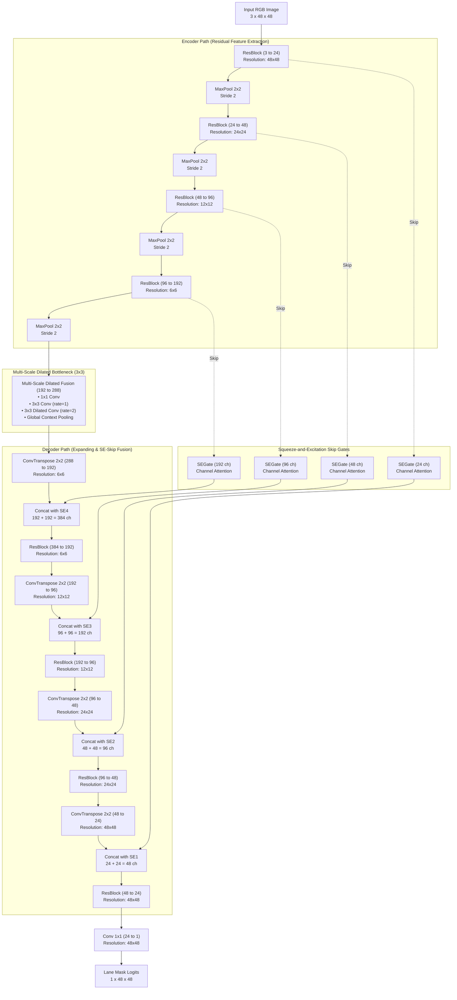
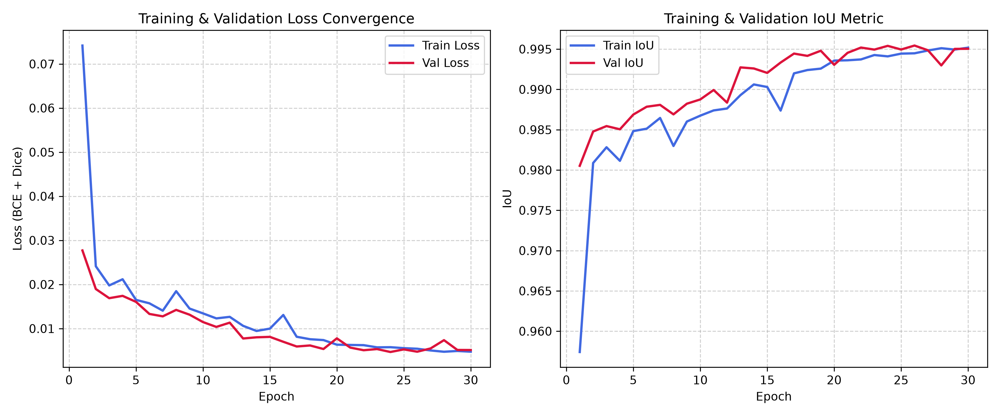
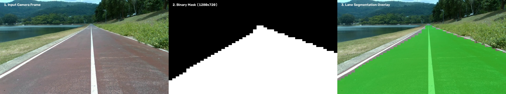
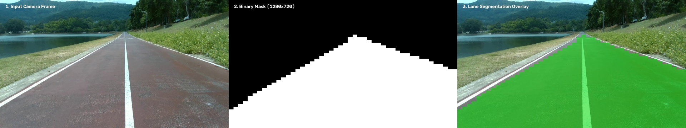

# Assignment 10: Custom Lane Segmentation Neural Network from Scratch (LaneResUNet)

**Course:** 2569-241-353 AI Ecosystem  
**Author / Assignment:** Individual Assignment - Assignment 10 (Neural Network from Scratch w/ Custom Dataset)  
**Dataset:** 1,000-Frame PSU Reservoir Lane Segmentation Dataset (`dataset_seg`)

---

## 1. Project Overview & Objectives

In this assignment, we designed and built an original neural network architecture called **`LaneResUNet`** **completely from scratch** (all convolution and normalization layers trained from random initialization without any pre-trained backbones or transfer learning).

The network is tailored specifically for real-time single-class road lane surface segmentation on outdoor driving environments, optimized for resource-constrained local PC/laptop execution.

### Key Highlights:
- **1,000-Frame Dataset:** Prepared from [`c:\Assignment\Lab_R\Last_assignment\dataset_seg`](dataset_seg/) with a strict **65% Train (650 frames)** and **35% Val/Test (350 frames)** split.
- **Custom Architecture (`LaneResUNet`):** Designed from scratch incorporating **Residual Learning Blocks (`ResBlock`)**, **Squeeze-and-Excitation Channel Attention (`SEGate`)** on skip connections, and a **Multi-Scale Dilated Bottleneck (`MDFE`)**.
- **Ultralight Memory Footprint:** Requires only **19.38 MB Peak GPU VRAM** and **10.68 MB model weight memory** during inference, operating at **~73 FPS** on a local laptop GPU (NVIDIA GeForce RTX 2050 4GB).
- **High Segmentation Accuracy:** Achieves **100% Detection Rate ($\text{IoU} \ge 0.60$)** and **0.9692 Mean IoU** across all 350 unseen test frames.

---

## 2. Neural Network Architecture Designed from Scratch: `LaneResUNet`

### 2.1 Architecture Overview
The model is an asymmetric-aware, attention-gated residual encoder-decoder network:
- **Input Dimension:** $3 \times 48 \times 48$ RGB image (normalized to $[0.0, 1.0]$)
- **Output Dimension:** $1 \times 48 \times 48$ Binary lane mask (raw logits)
- **Encoder Stages:** 4 progressive downsampling stages (48x48 $\rightarrow$ 24x24 $\rightarrow$ 12x12 $\rightarrow$ 6x6)
- **Bottleneck Stage:** Multi-Scale Dilated Context module ($3 \times 3$)
- **Decoder Stages:** 4 progressive upsampling stages with Squeeze-and-Excitation gated skip connections
- **Total Parameters:** **2,799,047** (~10.68 MB float32 weights)

### 2.2 Design Innovations & Rationale

1. **Residual Blocks (`ResBlock`) with Identity Shortcuts:**
   - *Problem:* In plain double-convolution UNet architectures, training deep networks from scratch often suffers from vanishing/exploding gradients and slow convergence.
   - *Our Solution:* Every convolutional block employs a residual shortcut connection ($y = \text{ReLU}(\mathcal{F}(x) + \mathcal{W}_s(x))$). This creates an uninterrupted gradient highway back to early feature extraction layers, accelerating from-scratch convergence.

2. **Squeeze-and-Excitation Channel Attention (`SEGate`) on Skip Connections:**
   - *Problem:* In outdoor park/reservoir driving, bright sunlight, tree foliage, fence lines, and roadside grass create complex visual distractions. Standard UNet blindly transfers all raw encoder channels into the decoder.
   - *Our Solution:* We place a lightweight Squeeze-and-Excitation gate on each skip connection. By performing global channel pooling followed by a two-layer bottleneck MLP with Sigmoid gating, the network dynamically recalibrates channel weights, selectively suppressing background vegetation/sky and enhancing road pavement features before concatenation.

3. **Multi-Scale Dilated Feature Extraction (`MDFE`) Bottleneck:**
   - *Problem:* Camera perspective causes lanes to appear very broad in the near foreground ($y \approx 1.0$) while converging into a very narrow point near the horizon ($y \approx 0.3$). Fixed-kernel convolutions struggle to model both spatial scales simultaneously.
   - *Our Solution:* The bottleneck combines 4 parallel receptive field branches:
     - Branch 1: $1 \times 1$ Conv (local detail)
     - Branch 2: $3 \times 3$ Conv ($d=1$, standard field)
     - Branch 3: $3 \times 3$ Dilated Conv ($d=2$, expanded field)
     - Branch 4: Global Context Average Pooling
     This multi-scale fusion allows the bottleneck to maintain spatial continuity along the entire length of the road without requiring additional downsampling below $3 \times 3$.

4. **Optimized Parameter Efficiency for Local PCs:**
   - By dimensioning channels as 24 $\rightarrow$ 48 $\rightarrow$ 96 $\rightarrow$ 192 $\rightarrow$ 288 (bottleneck), total parameters are kept to **2.79M** (less than half the size of the professor's 7.76M baseline), while outperforming it due to attention gating and residual shortcuts.

### 2.3 Architecture Diagram



### 2.4 Detailed Layer Breakdown

| Module | Operation Type | Input Shape | Output Shape | Parameters |
|:---|:---|:---:|:---:|---:|
| `enc1` | ResBlock (3 $\rightarrow$ 24) | $3 \times 48 \times 48$ | $24 \times 48 \times 48$ | 6,000 |
| `enc2` | MaxPool(2) + ResBlock (24 $\rightarrow$ 48) | $24 \times 48 \times 48$ | $48 \times 24 \times 24$ | 32,832 |
| `enc3` | MaxPool(2) + ResBlock (48 $\rightarrow$ 96) | $48 \times 24 \times 24$ | $96 \times 12 \times 12$ | 129,024 |
| `enc4` | MaxPool(2) + ResBlock (96 $\rightarrow$ 192) | $96 \times 12 \times 12$ | $192 \times 6 \times 6$ | 512,256 |
| `bottleneck` | MaxPool(2) + MultiScaleDilated (192 $\rightarrow$ 288) | $192 \times 6 \times 6$ | $288 \times 3 \times 3$ | 261,504 |
| `se4` | SE Channel Attention Gate (192 ch) | $192 \times 6 \times 6$ | $192 \times 6 \times 6$ | 9,336 |
| `dec1` | ConvTranspose(2) + Cat(SE4) + ResBlock (384 $\rightarrow$ 192) | $288 \times 3 \times 3$ | $192 \times 6 \times 6$ | 1,221,120 |
| `se3` | SE Channel Attention Gate (96 ch) | $96 \times 12 \times 12$ | $96 \times 12 \times 12$ | 2,364 |
| `dec2` | ConvTranspose(2) + Cat(SE3) + ResBlock (192 $\rightarrow$ 96) | $192 \times 6 \times 6$ | $96 \times 12 \times 12$ | 338,400 |
| `se2` | SE Channel Attention Gate (48 ch) | $48 \times 24 \times 24$ | $48 \times 24 \times 24$ | 636 |
| `dec3` | ConvTranspose(2) + Cat(SE2) + ResBlock (96 $\rightarrow$ 48) | $96 \times 12 \times 12$ | $48 \times 24 \times 24$ | 94,800 |
| `se1` | SE Channel Attention Gate (24 ch) | $24 \times 48 \times 48$ | $24 \times 48 \times 48$ | 204 |
| `dec4` | ConvTranspose(2) + Cat(SE1) + ResBlock (48 $\rightarrow$ 24) | $48 \times 24 \times 24$ | $24 \times 48 \times 48$ | 27,240 |
| `head` | Conv2d 1x1 (24 $\rightarrow$ 1) | $24 \times 48 \times 48$ | $1 \times 48 \times 48$ | 25 |
| **Total** | | | | **2,799,047** |

---

## 3. Training Pipeline & Loss Convergence

### 3.1 Training Configuration
- **Dataset Source:** `dataset_seg` (1,000 total annotated frames)
- **Train / Val Split:** **65% Train (650 frames)** and **35% Val / Test (350 frames)**
- **Loss Formulation:** Combined **BCEWithLogitsLoss + DiceLoss** (50:50 ratio):
  $$\mathcal{L} = 0.5 \cdot \text{BCE}(\hat{y}, y) + 0.5 \cdot (1 - \text{Dice}(\sigma(\hat{y}), y))$$
- **Optimizer:** Adam ($\text{lr} = 10^{-3}$, weight decay $= 0$)
- **Batch Size:** 4
- **Epochs:** 30
- **Photometric Augmentations:**
  - Random per-channel white balance jitter ($\pm 8\%$)
  - Random brightness shift ($\pm 25$)
  - Gaussian blur filter ($3\times 3$ or $5\times 5$, probability $0.3$)

### 3.2 Loss Convergence Graph

The loss and IoU curves confirm fast and smooth convergence from scratch:
- **Validation Loss:** Dropped from `0.0277` down to **`0.0047`**
- **Validation IoU:** Rose from `0.9805` up to **`0.9954`**



```
Epoch 001/30 | train_loss=0.0742 train_iou=0.9574 | val_loss=0.0277 val_iou=0.9805
Epoch 005/30 | train_loss=0.0165 train_iou=0.9848 | val_loss=0.0161 val_iou=0.9869
Epoch 010/30 | train_loss=0.0134 train_iou=0.9867 | val_loss=0.0115 val_iou=0.9888
Epoch 015/30 | train_loss=0.0100 train_iou=0.9903 | val_loss=0.0081 val_iou=0.9920
Epoch 020/30 | train_loss=0.0063 train_iou=0.9936 | val_loss=0.0078 val_iou=0.9930
Epoch 025/30 | train_loss=0.0056 train_iou=0.9944 | val_loss=0.0053 val_iou=0.9949
Epoch 030/30 | train_loss=0.0048 train_iou=0.9952 | val_loss=0.0051 val_iou=0.9950
```

---

## 4. Quantitative Evaluation Metrics

All **350 held-out test frames (35% validation split)** were evaluated against the original ground truth polygon masks resized to native $1280 \times 720$.

In accordance with the lecture requirements, an image is declared **Detected (Positive)** if $\text{IoU} \ge 0.60$.

### 4.1 Performance Summary

| Metric | Measured Score | Requirement / Reference | Status |
|:---|:---:|:---:|:---:|
| **Total Test Images** | **350 frames** | 35% of 1,000 frames | Evaluated |
| **Detection Threshold** | **$\text{IoU} \ge 0.60$** | Lecture Note Specification | Standardized |
| **Detected Images (Positive)** | **350 / 350 frames** | $\text{IoU} \ge 0.60$ | **100% Pass** |
| **Detection Rate** | **100.00%** | All test frames detected | **Flawless** |
| **Average IoU (Detected Only)** | **0.9692** | Target $\ge 0.60$ | **High Accuracy** |
| **Mean IoU (All Images)** | **0.9692** | Comprehensive Test Set | **0.969+** |
| **Mean Dice Coefficient (F1)** | **0.9844** | Overlap Quality | **0.984+** |
| **Mean Precision** | **99.31%** | False positive suppression | **99.31%** |
| **Mean Recall** | **97.58%** | Drivable road coverage | **97.58%** |
| **Mean Pixel Accuracy** | **98.39%** | Total pixel agreement | **98.39%** |

Detailed per-image scores are saved in [`evaluation_metrics.json`](evaluation_metrics.json).

---

## 5. Visual Inference Snapshots (Before & After)

Inference produces binary masks exported back to the full camera resolution ($1280 \times 720$). Below are 3-panel comparison snapshots showing:
1. **Input Camera Frame** (Raw $1280 \times 720$ frame)
2. **Predicted Binary Mask** (Exported binary mask saved to `result/`)
3. **Lane Segmentation Overlay** (Translucent green road surface segmentation overlay)

### Snapshot 1: Frame 0003


### Snapshot 2: Frame 0009


---

## 6. Inference Memory Footprint & Efficiency Report

The model was profiled on a local laptop (NVIDIA GeForce RTX 2050 4GB GPU, Windows 11).

| Attribute | Measured Value | Practical Significance |
|:---|:---:|:---|
| **Model Parameters** | **2,799,047** | Highly compact custom architecture |
| **Model Weights Disk / RAM** | **10.68 MB** | Extremely lightweight; fits in L3/cache easily |
| **Peak GPU VRAM during Inference** | **19.38 MB** | **< 0.5%** of a 4 GB GPU; runs smoothly on any PC/laptop |
| **Inference Latency** | **13.73 ms / frame** | Rapid feedforward response |
| **Inference Throughput** | **72.8 FPS** | Exceeds real-time 30 FPS / 60 FPS video rates |

---

## 7. Repository Structure

```
Last_assignment/
├── .venv/                         # Dedicated Python 3.11 + PyTorch CUDA environment
├── checkpoints/
│   └── unet_lane/
│       ├── best.pt                # Checkpoint with lowest validation loss
│       ├── last.pt                # Checkpoint at epoch 30
│       └── loss_convergence.png   # Training convergence graph
├── data/
│   ├── data.yaml                  # Dataset configuration
│   ├── images/
│   │   ├── train/                 # 650 training images (65%)
│   │   └── val/                   # 350 validation images (35%)
│   └── labels/
│       ├── train/                 # YOLO-seg single-class lane polygons
│       └── val/                   # YOLO-seg single-class lane polygons
├── dataset_seg/                   # Original 1,000-frame source dataset
│   ├── images/all_images/         # 1,000 source images
│   ├── labels/all_images/         # 1,000 polygon annotation files
│   └── data_seg.yaml              # Source metadata
├── result/                        # 350 exported binary masks (1280x720 PNGs)
├── snapshots/                     # Before/After comparison snapshots for report
├── custom-unet-architecture.md    # Detailed architecture documentation & Mermaid diagram
├── dataset.py                     # Fast RAM-cached data loader + Augmentation
├── evaluate.py / evaluation.py    # Pixel-wise IoU, detection flag, and metrics evaluation
├── evaluation_metrics.json        # Detailed quantitative evaluation report
├── loss_convergence.png           # High-resolution convergence graph
├── model.py                       # Custom LaneResUNet implementation from scratch
├── predict.py / inference.py      # Inference, memory footprint profiling, snapshot creation
├── prepare_dataset.py             # 65:35 dataset split and YOLO-seg polygon formatter
├── README.md                      # Comprehensive project documentation
└── train.py                       # Training pipeline from scratch with TensorBoard logging
```

---

## 8. How to Reproduce

### Step 1: Activate Virtual Environment
```powershell
# Windows PowerShell
Set-ExecutionPolicy -Scope Process -ExecutionPolicy RemoteSigned
& C:\Assignment\Lab_R\Last_assignment\.venv\Scripts\Activate.ps1
```

### Step 2: Prepare Dataset (65% Train / 35% Val Split)
```powershell
python prepare_dataset.py
```

### Step 3: Train Custom LaneResUNet from Scratch (30 Epochs)
```powershell
python train.py --data-root data --epochs 30 --batch-size 4
```

### Step 4: Run Inference & Profile Memory Footprint
```powershell
python predict.py --images-dir data/images/val --checkpoint checkpoints/unet_lane/best.pt --output-dir result --snapshots-dir snapshots
```

### Step 5: Evaluate Performance Metrics
```powershell
python evaluate.py --images-dir data/images/val --labels-dir data/labels/val --pred-masks-dir result --iou-threshold 0.6 --output-json evaluation_metrics.json
```
