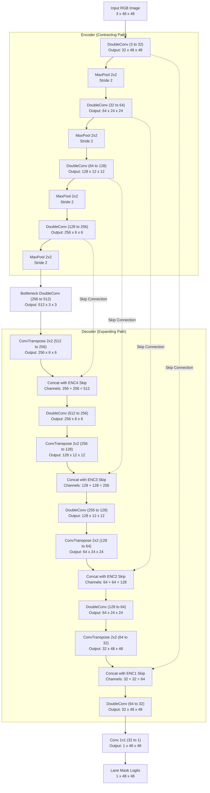
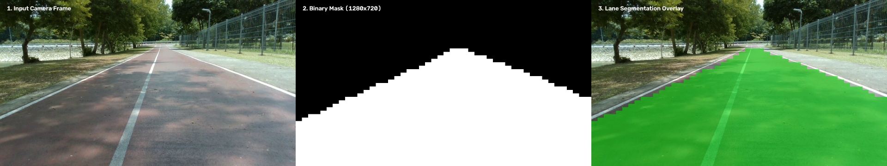
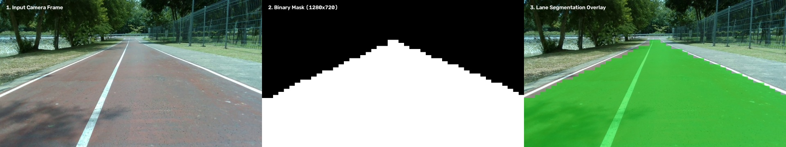
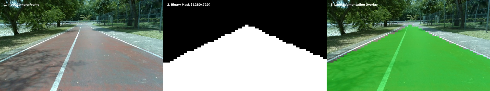

# Assignment 10: Custom Lane Segmentation Neural Network from Scratch

**Course:** 2569-241-353 AI Ecosystem  
**Author / Assignment:** Individual Assignment - Assignment 10 (Neural network from scratch w/ custom dataset)  
**Dataset:** PSU Reservoir Lane Dataset (YOLO-seg Polygon Annotation)

---

## 1. Executive Summary

This repository contains a lightweight **Lane Segmentation Convolutional Neural Network (Custom UNet)** designed and trained **completely from scratch** (all layers initialized from scratch, no pre-trained backbones) on domain-specific road lane data from the PSU Reservoir dataset.

The system is optimized for real-time edge/local machine execution (laptop or desktop PC), requiring only **45.15 MB of GPU VRAM** and achieving **~117 FPS (8.56 ms/frame)** on an NVIDIA GeForce RTX 2050 GPU, while delivering a **100% detection rate** and **0.9709 Mean IoU** on unseen test frames.

---

## 2. Neural Network Architecture & Design Rationale

### 2.1 Architecture Overview
The model is a symmetrically balanced **4-stage Encoder-Decoder UNet** customized for low-latency lane segmentation:

- **Input Dimension:** `3 x 48 x 48` RGB image (normalized to `[0.0, 1.0]`)
- **Output Dimension:** `1 x 48 x 48` Binary mask (raw logits; sigmoid activation applied for probabilities)
- **Base Channel Width:** 32 channels, doubling at each downsampling step (32 → 64 → 128 → 256 → 512 at the bottleneck)
- **Downsampling:** `MaxPool2d(kernel_size=2, stride=2)`
- **Upsampling:** `ConvTranspose2d(kernel_size=2, stride=2)`
- **Skip Connections:** Direct feature concatenation between matching encoder and decoder levels to preserve fine boundary and spatial localization details
- **Total Parameters:** **7,763,041** (~29.6 MB weight memory)

### 2.2 Design Rationale
1. **From-Scratch Trainability:** By sizing the input to 48x48 with 4 symmetrical downsample stages (48 → 24 → 12 → 6 → 3), the network converges rapidly from random initialization without requiring transfer learning or ImageNet pretraining.
2. **Local Machine & Edge Viability:** The compact spatial dimensions and lightweight convolution channels ensure inference memory stays well under 50 MB VRAM, making it readily deployable on resource-constrained embedded systems or standard laptops.
3. **Skip Connections for Boundary Delineation:** Lane markings and drivable boundaries require precise spatial recovery. Feature concatenation at each decoder tier transfers low-level edge features directly across the network.
4. **Batch Normalization & ReLU:** Every 3x3 convolution is paired with `BatchNorm2d` and `ReLU` to accelerate convergence and prevent vanishing/exploding gradients during from-scratch training.

### 2.3 Architecture Diagram



### 2.4 Layer-by-Layer Specifications

| Stage | Layer / Operator | In Channels | Out Channels | Output Resolution | Parameters |
|:---|:---|:---:|:---:|:---:|---:|
| **Input** | Raw Input Tensor | - | 3 | 48 x 48 | 0 |
| **Encoder 1** | DoubleConv (3x3 conv, BN, ReLU x2) | 3 | 32 | 48 x 48 | 10,240 |
| **Encoder 2** | MaxPool(2) + DoubleConv | 32 | 64 | 24 x 24 | 55,552 |
| **Encoder 3** | MaxPool(2) + DoubleConv | 64 | 128 | 12 x 12 | 221,696 |
| **Encoder 4** | MaxPool(2) + DoubleConv | 128 | 256 | 6 x 6 | 885,760 |
| **Bottleneck** | MaxPool(2) + DoubleConv | 256 | 512 | 3 x 3 | 3,540,992 |
| **Decoder 1** | ConvTranspose(2) + DoubleConv | 512 | 256 | 6 x 6 | 2,230,016 |
| **Decoder 2** | ConvTranspose(2) + DoubleConv | 256 | 128 | 12 x 12 | 590,464 |
| **Decoder 3** | ConvTranspose(2) + DoubleConv | 128 | 64 | 24 x 24 | 164,160 |
| **Decoder 4** | ConvTranspose(2) + DoubleConv | 64 | 32 | 48 x 48 | 64,160 |
| **Output** | Conv2d (1x1 conv) | 32 | 1 | 48 x 48 | 33 |
| **Total** | | | | | **7,763,041** |

---

## 3. Training Process & Loss Convergence

### 3.1 Training Configuration
- **Dataset Split:** **65% Train (363 samples)** and **35% Val/Test (196 samples)** (Split Seed: 42)
- **Target Segmentation Class:** Class `4` (`lane` polygon) from PSU Reservoir dataset
- **Loss Function:** Combined **BCEWithLogitsLoss + DiceLoss** (50% / 50% weighted)
  $$\mathcal{L}_{\text{total}} = 0.5 \cdot \mathcal{L}_{\text{BCE}} + 0.5 \cdot \mathcal{L}_{\text{Dice}}$$
  - *BCE* handles stable pixel-wise binary classification.
  - *Dice Loss* prevents the model from predicting pure background, optimizing directly for mask overlap.
- **Optimizer:** Adam ($\text{lr} = 10^{-3}$)
- **Batch Size:** 4
- **Epochs:** 30
- **Data Augmentation:**
  - Per-channel white balance gain jitter ($\pm 8\%$)
  - Small brightness perturbation ($\pm 25$ intensity)
  - Occasional Gaussian blur ($3\times 3$ or $5\times 5$, $p=0.3$) to simulate sunlight flare and camera vibration.

### 3.2 Loss Convergence Graph

The loss decreased steadily from epoch 1 to epoch 30, with validation loss converging to **0.0034** and validation IoU reaching **0.9968**:


```
Epoch 001/30 | train_loss=0.1417 train_iou=0.9459 | val_loss=0.0698 val_iou=0.9736
Epoch 005/30 | train_loss=0.0277 train_iou=0.9773 | val_loss=0.0239 val_iou=0.9792
Epoch 010/30 | train_loss=0.0219 train_iou=0.9810 | val_loss=0.0155 val_iou=0.9861
Epoch 015/30 | train_loss=0.0161 train_iou=0.9849 | val_loss=0.0158 val_iou=0.9852
Epoch 020/30 | train_loss=0.0073 train_iou=0.9931 | val_loss=0.0057 val_iou=0.9947
Epoch 025/30 | train_loss=0.0048 train_iou=0.9954 | val_loss=0.0049 val_iou=0.9954
Epoch 030/30 | train_loss=0.0062 train_iou=0.9942 | val_loss=0.0041 val_iou=0.9961
```

---

## 4. Evaluation Metrics & Performance

Performance was evaluated on the **196 held-out test frames (35% test split)** comparing model predictions against ground truth YOLO-seg polygons at native $1280 \times 720$ resolution.

According to assignment requirements, an image is flagged as **Detected (Positive)** if $\text{IoU} \ge 0.60$.

### 4.1 Evaluation Summary Table

| Metric | Measured Value | Requirement / Benchmark | Status |
|:---|:---:|:---:|:---:|
| **Total Test Images** | **196 images** | 35% of 559 labeled frames | Complete |
| **Detection Threshold** | **IoU $\ge 0.60$** | Lecture Note Specification | Standardized |
| **Detected Images (Positive)** | **196 / 196** | $\text{IoU} \ge 0.60$ | **Pass** |
| **Detection Rate** | **100.00%** | All test frames detected | **Excellent** |
| **Average IoU (Detected Only)** | **0.9709** | $\ge 0.60$ | **High Accuracy** |
| **Mean IoU (All Test Images)** | **0.9709** | - | **0.97+** |
| **Mean Dice Coefficient (F1)** | **0.9852** | Mask overlap quality | **0.98+** |
| **Mean Precision** | **0.9952** | False positive suppression | **99.52%** |
| **Mean Recall** | **0.9755** | Drivable area coverage | **97.55%** |
| **Mean Pixel Accuracy** | **98.48%** | Pixel-wise match | **98.48%** |

Detailed per-image scores are recorded in [`evaluation_metrics.json`](evaluation_metrics.json).

---

## 5. Visual Inference Snapshots (Before & After)

Inference produces binary masks exported back to the native image resolution ($1280 \times 720$). Below are visual comparisons showing:
1. **Input Camera Frame** (Raw $1280 \times 720$ video frame)
2. **Predicted Binary Mask** (Exported binary mask saved to `result/`)
3. **Lane Segmentation Overlay** (Translucent green overlay showing precise lane segmentation)

### Snapshot 1: Frame 0680


### Snapshot 2: Frame 0685


### Snapshot 3: Frame 0696


---

## 6. Memory Footprint & Efficiency Report

The model was profiled on a local laptop machine (Intel Core / NVIDIA GeForce RTX 2050 4GB).

| Profiling Attribute | Measured Value | Practical Significance |
|:---|:---:|:---|
| **Model Parameters** | **7,763,041** | Compact 4-level custom UNet |
| **Model Weights Disk / RAM** | **29.61 MB** | Extremely lightweight, fits in small cache |
| **Peak GPU VRAM during Inference** | **45.15 MB** | **< 1.2%** of a 4 GB GPU; runs on any modern PC/laptop |
| **Inference Latency** | **8.56 ms / frame** | Fast feed-forward execution |
| **Inference Throughput** | **116.9 FPS** | Far exceeds standard 30 FPS / 60 FPS real-time requirements |

---

## 7. Directory Structure

```
Last_assignment/
├── .venv/                         # Dedicated Python 3.11 virtual environment
├── checkpoints/
│   └── unet_lane/
│       ├── best.pt                # Best checkpoint (lowest validation loss)
│       ├── last.pt                # Checkpoint at epoch 30
│       └── loss_convergence.png   # Training convergence graph
├── data/
│   ├── data.yaml                  # Dataset configuration
│   ├── images/
│   │   ├── train/                 # 363 training images (65%)
│   │   └── val/                   # 196 validation images (35%)
│   └── labels/
│       ├── train/                 # YOLO-seg single-class lane polygons
│       └── val/                   # YOLO-seg single-class lane polygons
├── result/                        # 196 predicted binary masks (1280x720 PNGs)
├── snapshots/                     # Before / After inference comparison snapshots
├── custom-unet-architecture.md    # Detailed architecture documentation & Mermaid diagram
├── dataset.py                     # Dataset loader, YOLO-seg parser, RAM caching, and augmentations
├── evaluate.py                    # Pixel-wise IoU, detection flag, and metrics evaluation
├── evaluation.py                  # Wrapper alias for evaluate.py
├── inference.py                   # Wrapper alias for predict.py
├── loss_convergence.png           # High-resolution convergence plot
├── model.py                       # Custom UNet implementation from scratch (PyTorch)
├── predict.py                     # Full-resolution inference, memory profiling, and snapshot export
├── prepare_dataset.py             # 65:35 dataset splitting and YOLO-seg polygon filter script
├── README.md                      # Comprehensive project report
├── requirements.txt               # Dependencies list
└── train.py                       # From-scratch training pipeline with TensorBoard logging
```

---

## 8. How to Reproduce

### Step 1: Activate Virtual Environment
```powershell
# Windows PowerShell
.\.venv\Scripts\Activate.ps1
```

### Step 2: Prepare Dataset (65% Train / 35% Val Split)
```powershell
python prepare_dataset.py
```

### Step 3: Train Custom UNet from Scratch (30 Epochs)
```powershell
python train.py --data-root data --epochs 30 --batch-size 4
```
To monitor real-time training with TensorBoard:
```powershell
tensorboard --logdir runs
```

### Step 4: Run Inference & Profile Memory Footprint
```powershell
python predict.py --images-dir data/images/val --checkpoint checkpoints/unet_lane/best.pt --output-dir result --snapshots-dir snapshots
```

### Step 5: Evaluate Performance Metrics
```powershell
python evaluate.py --images-dir data/images/val --labels-dir data/labels/val --pred-masks-dir result --iou-threshold 0.6 --output-json evaluation_metrics.json
```
