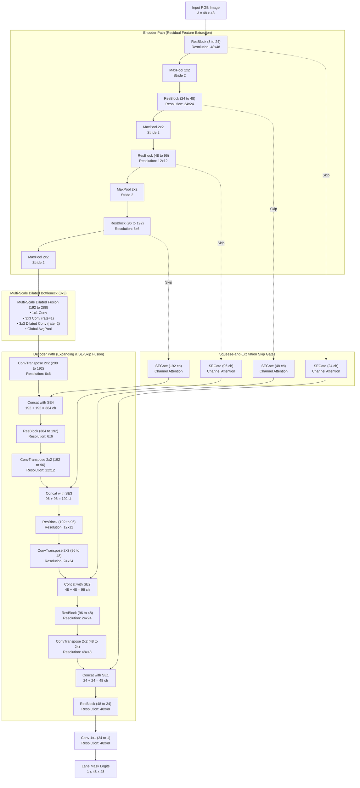

# Custom LaneResUNet Architecture — Lane Segmentation

**Model Name:** `LaneResUNet` (Residual UNet with Squeeze-and-Excitation Attention & Multi-Scale Dilated Bottleneck)  
**Task:** Single-class binary road lane segmentation  
**Input:** `3 x 48 x 48` RGB image (normalized to `[0, 1]`)  
**Output:** `1 x 48 x 48` Binary lane mask logits (pass through Sigmoid for pixel probability)  
**Implementation:** [`model.py`](model.py)

---

## 1. Architectural Innovations

1. **Residual Double-Conv Blocks (`ResBlock`):**
   - Each encoder and decoder stage uses residual blocks with identity / 1x1 projection shortcuts.
   - Eliminates vanishing gradients and enables fast, smooth convergence when training from scratch without pre-trained backbones.
2. **Squeeze-and-Excitation Channel Attention (`SEGate`) on Skip Connections:**
   - Instead of passing raw encoder feature maps, each skip connection is dynamically recalibrated through channel attention.
   - Suppresses background noise (trees, sky, fence, grass) and amplifies road pavement / lane boundary channels before concatenation.
3. **Multi-Scale Dilated Bottleneck (`MDFE`):**
   - Perspective road geometry causes foreground lanes to be wide while distant lanes converge to a fine vanishing point.
   - The bottleneck fuses parallel $1\times 1$, standard $3\times 3$ ($d=1$), and atrous $3\times 3$ ($d=2$) convolutions plus global pooling to capture multi-scale context without downsampling below $3\times 3$.
4. **Lightweight Footprint:**
   - 2,799,047 parameters (~10.7 MB weights), ideal for low-power edge devices and laptop PC execution.

---

## 2. Mermaid Architecture Diagram

---

## 3. Layer-by-Layer Specifications

| Stage | Module Name | Input Shape ($C \times H \times W$) | Output Shape ($C \times H \times W$) | Operations | Parameters |
|:---|:---|:---:|:---:|:---|---:|
| **Input** | Raw Image | $3 \times 48 \times 48$ | $3 \times 48 \times 48$ | RGB Normalization | 0 |
| **Encoder 1** | `enc1` | $3 \times 48 \times 48$ | $24 \times 48 \times 48$ | ResBlock (Conv 3 $\rightarrow$ 24, BN, ReLU, Shortcut) | 6,000 |
| **Encoder 2** | `enc2` | $24 \times 48 \times 48$ | $48 \times 24 \times 24$ | MaxPool(2) + ResBlock (24 $\rightarrow$ 48) | 32,832 |
| **Encoder 3** | `enc3` | $48 \times 24 \times 24$ | $96 \times 12 \times 12$ | MaxPool(2) + ResBlock (48 $\rightarrow$ 96) | 129,024 |
| **Encoder 4** | `enc4` | $96 \times 12 \times 12$ | $192 \times 6 \times 6$ | MaxPool(2) + ResBlock (96 $\rightarrow$ 192) | 512,256 |
| **Bottleneck** | `bottleneck` | $192 \times 6 \times 6$ | $288 \times 3 \times 3$ | MaxPool(2) + MultiScaleDilated (192 $\rightarrow$ 288) | 261,504 |
| **Skip Gate 4** | `se4` | $192 \times 6 \times 6$ | $192 \times 6 \times 6$ | SE Channel Attention Gate | 9,336 |
| **Decoder 1** | `dec1` | $288 \times 3 \times 3$ | $192 \times 6 \times 6$ | ConvTranspose(2) + Cat(SE4) + ResBlock(384 $\rightarrow$ 192) | 1,221,120 |
| **Skip Gate 3** | `se3` | $96 \times 12 \times 12$ | $96 \times 12 \times 12$ | SE Channel Attention Gate | 2,364 |
| **Decoder 2** | `dec2` | $192 \times 6 \times 6$ | $96 \times 12 \times 12$ | ConvTranspose(2) + Cat(SE3) + ResBlock(192 $\rightarrow$ 96) | 338,400 |
| **Skip Gate 2** | `se2` | $48 \times 24 \times 24$ | $48 \times 24 \times 24$ | SE Channel Attention Gate | 636 |
| **Decoder 3** | `dec3` | $96 \times 12 \times 12$ | $48 \times 24 \times 24$ | ConvTranspose(2) + Cat(SE2) + ResBlock(96 $\rightarrow$ 48) | 94,800 |
| **Skip Gate 1** | `se1` | $24 \times 48 \times 48$ | $24 \times 48 \times 48$ | SE Channel Attention Gate | 204 |
| **Decoder 4** | `dec4` | $48 \times 24 \times 24$ | $24 \times 48 \times 48$ | ConvTranspose(2) + Cat(SE1) + ResBlock(48 $\rightarrow$ 24) | 27,240 |
| **Output Head**| `head` | $24 \times 48 \times 48$ | $1 \times 48 \times 48$ | Conv2d (1x1 conv) | 25 |
| **Total** | | | | | **2,799,047** |
