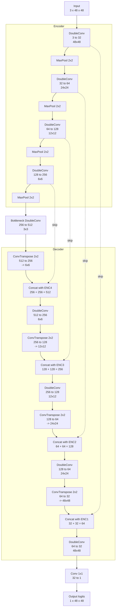

# Custom UNet Architecture — Lane Segmentation

Single-class (lane) binary segmentation network. Input `3x48x48` RGB, output
`1x48x48` logits (apply sigmoid + threshold for a binary mask). Implementation:
[model.py](model.py).

- Base channel width: 32 (doubles each downsample: 32 → 64 → 128 → 256 → 512)
- 4 encoder stages + bottleneck, 4 decoder stages with skip connections
- Downsample: `MaxPool2x2`; Upsample: `ConvTranspose2x2`
- Each conv stage is a `DoubleConv`: `(Conv3x3 → BatchNorm → ReLU) x2`

## Layer-by-layer summary

| Stage      | Operation                     | Output shape (C x H x W) |
|------------|--------------------------------|---------------------------|
| Input      | —                               | 3 x 48 x 48                |
| Encoder 1  | DoubleConv(3, 32)                | 32 x 48 x 48                |
| Encoder 2  | MaxPool + DoubleConv(32, 64)     | 64 x 24 x 24                |
| Encoder 3  | MaxPool + DoubleConv(64, 128)    | 128 x 12 x 12                |
| Encoder 4  | MaxPool + DoubleConv(128, 256)   | 256 x 6 x 6                  |
| Bottleneck | MaxPool + DoubleConv(256, 512)   | 512 x 3 x 3                  |
| Decoder 1  | ConvTranspose(512,256) + concat(Enc4) + DoubleConv(512,256) | 256 x 6 x 6 |
| Decoder 2  | ConvTranspose(256,128) + concat(Enc3) + DoubleConv(256,128) | 128 x 12 x 12 |
| Decoder 3  | ConvTranspose(128,64) + concat(Enc2) + DoubleConv(128,64)   | 64 x 24 x 24 |
| Decoder 4  | ConvTranspose(64,32) + concat(Enc1) + DoubleConv(64,32)     | 32 x 48 x 48 |
| Output     | Conv1x1(32, 1)                   | 1 x 48 x 48 (logits)          |

Total parameters: ~7.7M (printed by running `python model.py`).
